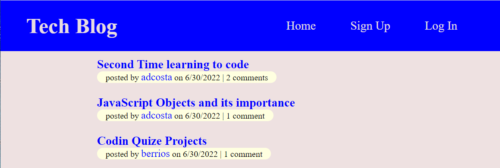
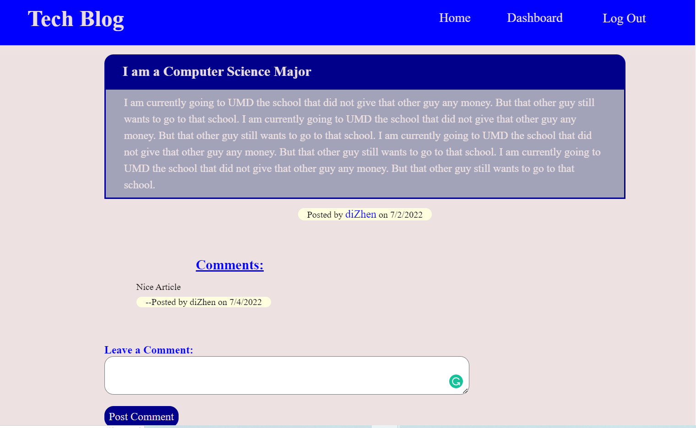
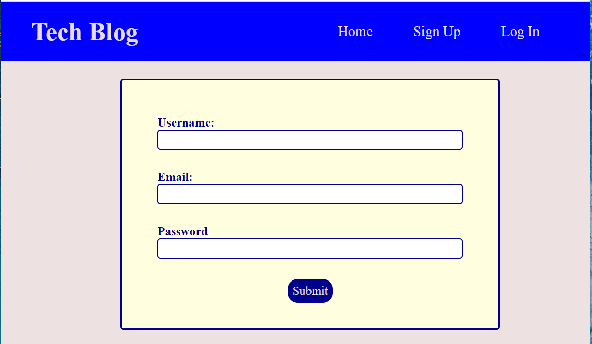
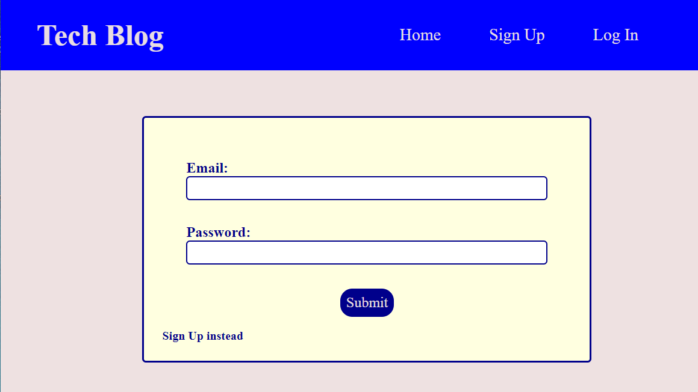
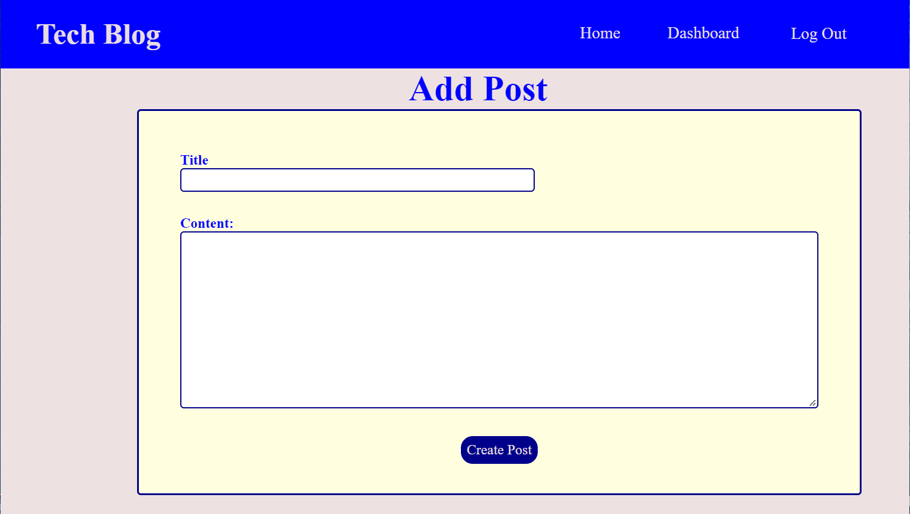
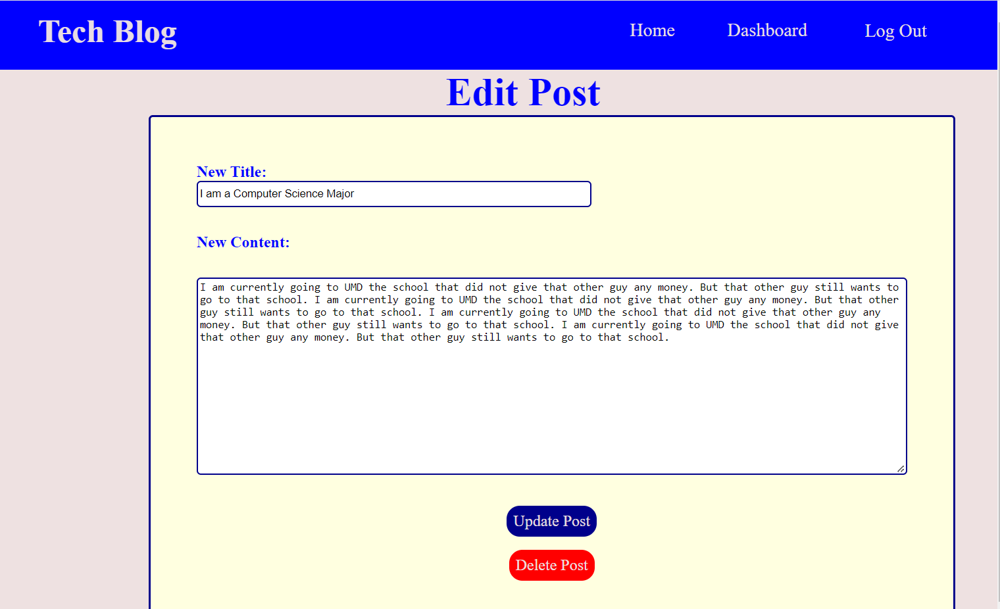

# Tech Blog Website

## Project Description 
This is a blogger website for blogs related to Web technologies. Unregistered users can see the posts created by the registered users. It shows the date the post was created, the user that posted the post and any comments left by registered users. An user can register by creating an account. The user can then use their credentials to log into the site. Once logged in, the users can create new post, add comments to other posts or their posts, edit or delete their created posts. 

## Table of Contents
- **[Project Description](#project-description)**  
  
- **[Web Tools Used](#web-tools-used)**

- **[Using the Site](#using-the-site)**

- **[Future Improvement Needed](#future-improvement-needed)**

## Web Tools Used.
The back-end and front-end parts of the application used different tech tools.  
- __Backend portion tools:__
  - Node.js
  - MySQL (for storing data in a relational database)
  - Sequelize (Object Relational Mapping (ORM) with MySQL)
  - express.js (for serving the site and handling browser requests)
  - dotenv.js (used for sensitive information used)
  - mysql2 (used along with Sequqlize ORM to qeury MySQL database)
  - Handlebars (template engine, used for producing HTML pages for the site)
- __Frontend portion tools:__
  - CSS for adding style to the HTML pages created through handlebars.
  - Javascript for browser environment logic.

## Using the Site
The site can be visited through [this link]().  
Once the link is cliked, the user is presented with the homepage:  

  
The hompage contains the navigation link that can route the user to different pages contained in the site. Furthermore, the current blogs' titles are listed for the user. The user, registered or unregistered,  can click on any of the titles and they will be routed to a page with the content of that blog. It is shown in the following image:  

The above page will be shown if an user clicks on the title 'I am a Computer Science Major' in the homepage.

Unregistered users can sign up thorugh this page:  

Registered users can log in through this page:

Registered users can add and edit posts through the following site images respactively:

## Future Improvement Needed
The website color combination and design is too generic. The site can be made more vibrant and lively by adding animations and more user interaction:  
- Make the site movile responsive. Currently the visuals of the site breaks down on mobile screens.
- Fade in Animation in drag.
- Giving users option to choose between night and day mode.
- Link elements enlarging animation on hover in the navigation.
- Giving 3D effects such as box shadows to the form elements.
- Replace the default font size when inputting on text boxex.
